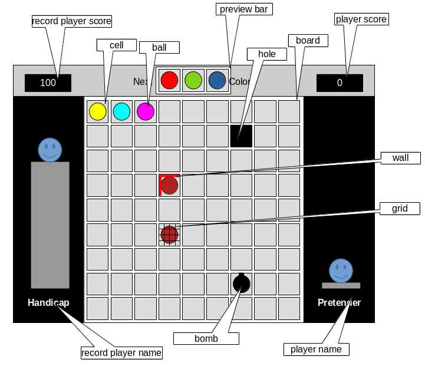

= Color Shapes Engine - Documentation

////
weight=900
////

////
+++
title = "About"
date = "2023-05-09"
menu = "main"
+++
////

== Board

Color Shapes is played on a square board divided into a grid of cells. _In other words, the board has columns and rows._

Attributes: 

. Width: Type=Number Min=3 Max=32 Default=9.
. Height: Type=Number Min=3 Max=32 Default=9.
. List of cells: Type=List Min=9 Max=1024 Default=81
   * Count of list of cells depends on width and height (= width * height).
. List of holes: Type=List Min=0 Max={board.width * board.height} / 2. Default=0

== Cell

Cell is a place, where balls can be inserted.

Attributes: 

. Ball: Type=Ball or nothing Default=nothing
. Top wall: Type=yes or no Default=no
. Right wall: Type=yes or no Default=no
. Bottom wall: Type=yes or no Default value=no
. Left wall: Type=yes or no Default=no
. Lock: Type=yes or no Default=no

== Hole

Hole is special kind of cell, where is nothing: no ball, no walls, no lock.

Attributes: 

1. Row number: Type=number Min=0 Maximum={board.height} Default=n/a
2. Column number: Type=number Min=0 Max={board.width} Default=n/a

== Ball
Attributes:

. Ball type: Type: Ball type
. Colour: Type Colour
. Value
. Movable
. Breakable
. Exploded

|===
|Name | Description | Type | Min | Max | Default value

| Value | Multiplies the standard earned points | number | -2 | 2 | 1
| Movable | Ball can be moved (boolean) | yes or no | n/a | n/a | yes
| Breakable | Ball can explode (boolean) | yes or no | n/a | n/a | yes
| Exploded | Only for bomb ball types | yes or no | n/a | n/a | no
|===

_Note: Shape cannot be arranged only from joker balls. Rainbow balls have colour 0, value 1, movable true and breakable true._

CAUTION: Todo: Rainbow: Behaves as a joker, which can be used as any color ball to complete a shape.

== Ball type

Type: enum. Minimum value: n/a. Maximum value: n/a. Default value:n/a

Possible values:

 . COLORED ... Stands for any colour.
 ** *Rules:*
 *** Colour must be at least 1 and at most 16.
 . JOKER
 ** *Rules:*
 *** Colour must be 0.
 *** Movable must be true.
 *** Breakable must be true.
 . AUTOMATIC_BOMB ... This is a bomb.
 ** *Rules:*
 *** Colour must be 0.
 *** Movable must be false.
 *** Breakable must be true.
 *** Automatic balls explode immediately after placing to the board and cannot be moved because of this.
 . MANUAL_BOMB ... This is a bomb.
 ** *Rules:*
 *** Colour must be 0.
 *** Movable must be true.
 *** Breakable must be true.
 *** Manual balls can be moved like balls and explodes only after their activation (Double activation of their cell)
 . PAINT_BOMB ... This is a bomb.
 ** *Rules:*
 *** Colour must be 0.
 *** Movable must be true.
 *** Breakable must be true.

== Colour

A number representing one of 16 colours.

Type=number Min=0 Max=16 Default=Min 1 and max 7

If colour is 0, then it means no colour.

 . light green
 . red
 . dark blue
 . yellow
 . light blue
 . purple
 . brown
 . pink
 . green
 . gold
 . orange
 . white
 . gray
 . black
 . blue
 . army green

== Wall

If a wall is present between two cells, then moving ball between these cells is forbidden.
 * No ball can be moved through a ball.

== Grid

If a cell has a grid, then moving a ball to or from this cell is forbidden.

== Preview bar 

Preview bar shows the next balls. Preview bar can be hidden.

You can see what balls will be randomly placed in the next turn on the next board, but this hint can be hidden to make the game a little bit harder.

== Player name

Default=Pretender

== Record player name

Default=Handicap

== Player score

Player score shows the current sum of earned points and is updated during the game every time, player earns new points.

== Record player score

Record player score shows the sum of earned points of the record player and is not changed during the game, because the record is changed only in case, a new game is finished with a record point count.
