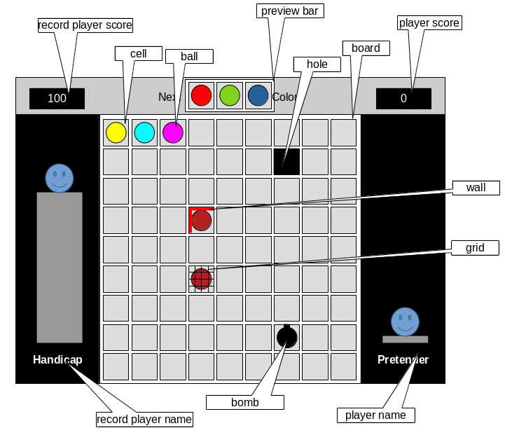
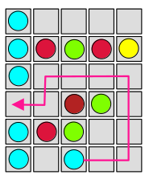
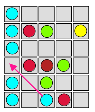
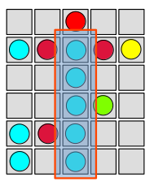
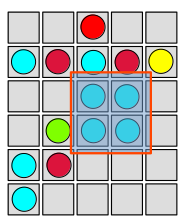
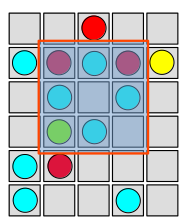

= Color Shapes Engine - Documentation

////
+++
title = "About"
date = "2023-05-09"
menu = "main"
+++
////

This site provides documentation for "Color Shapes Engine" application.

== Introduction

*Color Shapes* is a board game. Its rules are based on game *Color linez*.

It has an engine and several user interfaces like:

 * *Color Shapes Engine* is a library written in Java programming language, which contains the rules of "Color Shapes". It has no graphical interface. 
 * *Color Shapes Desktop* is a desktop game. It uses *Color Shapes Engine* and provides graphical user interface.

Collect points and beat your friends. It is probably harder than you thought.

WARNING: You will probably spend a lot of hours of fun with this game and never forget. It will probably steal a lot of your free time at school or office or at home. It is simple to begin playing it but it is hard to stop. You maybe play this game almost every day.

This single-player game is a simple mind-bending funny wonderful cool relaxing time wasting challenging, but very interesting addictive entertaining colorful, logic strategy matching board puzzle turn-based game, which improves logical reasoning ability, and concentration. It is a great idea.

== Visual game parts

Color Shapes consits of several parts. Let's see more:

=== Board
Board is collection of cells organized in horizontal and vertical form.

*Board attributes:*

|===
| Name | Description | Type | Min | Max | Default | Note

| Width | Column count | number | 3 | 32 | 9 | 
| Height |  Row count | number | 3 | 32 | 9 | 
| Set of cells | | set | 9 | 1024 | 81 | Count of cells depends on width and height (= width * height). 
| Set of holes | | set | 0 | {width * height} / 2 | 0 | 
|===

=== Cells

Cell is a place, where balls can be inserted.

*Cell attributes:*

|===
| Name | Description | Type | Default value

| Ball | | Ball or nothing | nothing 
| Top wall | | yes or no | no 
| Right wall | | yes or no | no 
| Bottom wall | | yes or no | no 
| Left wall | | yes or no | no 
| Lock | | yes or no | no 
|===

=== Holes

Hole is special kind of cell, where is nothing: no ball, no walls, no lock

*Hole attributes:*

|===
|Name | Description | Type | Default value

| Row number | |number | n/a
| Column number | | number | n/a
|===

=== Balls

*Ball attributes:*

|===
|Name | Description | Type | Min | Max | Default value

| Ball type | | enum | n/a | n/a | n/a
| Colour | One of the 16 | number | 0 | 16 | Min 1 and max 7
| Value | Multiplies the standard earned points | number | -2 | 2 | 1
| Movable | Ball can be moved (boolean) | yes or no | n/a | n/a | yes
| Breakable | Ball can explode (boolean) | yes or no | n/a | n/a | yes
| Exploded | Only for bomb ball types | yes or no | n/a | n/a | no
|===

_Note: Shape cannot be arranged only from joker balls. Rainbow balls have colour 0, value 1, movable true and breakable true._

CAUTION: Todo: Rainbow: Behaves as a joker, which can be used as any color ball to complete a shape.

==== Ball type

===== COLORED

 * Colour must be at least 1 and at most 16.

===== JOKER

 * Colour must be 0.
 * Movable must be true.
 * Breakable must be true.
 * Stands for any colour.

===== AUTOMATIC_BOMB

 * Bomb.
 * Colour must be 0.
 * Movable must be false.
 * Breakable must be true.
 * Automatic balls explode immediately after placing to the board and cannot be moved because of this.

===== MANUAL_BOMB

 * Bomb.
 * Colour must be 0.
 * Movable must be true.
 * Breakable must be true.
 * Manual balls can be moved like balls and explodes only after their activation (Double activation of their cell)

===== PAINT_BOMB

 * Bomb.
 * Colour must be 0.
 * Movable must be true.
 * Breakable must be true.

===== Colour

 * light green
 * red
 * dark blue
 * yellow
 * light blue
 * purple
 * brown
 * pink
 * green
 * gold
 * orange
 * white
 * gray
 * black
 * blue
 * army green

=== Wall
Prevents to move a ball between two surrounding cells.

=== Grid
Prevents to move a ball to or from a cell.

=== Preview bar 

Preview bar shows the next balls. These preview bar can be hidden.

You can see what balls will be randomly placed in the next turn on the next board, but this hint can be hidden to make the game a little bit harder.

=== Player name

Player name is Pretender by default

=== Record player name

Player name is Handicap by default

=== Player score

Player score shows the current sum of earned points and is updated during the game every time, player earns new points.

=== Record player score

Record player score shows the sum of earned points of the record player and is not changed during the game, because the record is changed only in case, a new game is finished with a record point count.

== Inner game parts

=== Ball factory

=== Ball thrower

Some clones shows also the positions of the next balls. This is a hint.

|===
| Name | Description | Min | Max | Default

| Start ball count | One of the 16 | 1 | ? | 5
| Next ball count | Multiplies the standard earned points. | 1 | ? | 3
|===

=== Shape finder

==== Bomb exploding alghoritm

|===
|  |  |  |  |  |  | x  |  |  |  | 
|  |  | -4 | -3 | -2 | -1 | 0 | 1 | 2 | 4 | 4
|  | 4 | 56 | 77 | 61 | 65 | 49 | 69 | 57 | 53 | 53
|  | 3 | 76 | 32 | 45 | 37 | 25 | 33 | 41 | 79 | 79
|  | 2 | 60 | 44 | 16 | 21 | 9 | 17 | 13 | 63 | 63
|  | 1 | 72 | 36 | 24 | 8 | 1 | 5 | 19 | 67 | 67
| y  | 0 | 52 | 28 | 12 | 4 | *0* | 3 | 11 | 51 | 51
|  | -1 | 68 | 40 | 20 | 6 | 2 | 7 | 23 | 71 | 71
|  | -2 | 64 | 48 | 14 | 18 | 10 | 22 | 15 | 59 | 59
|  | -3 | 80 | 30 | 42 | 34 | 26 | 38 | 46 | 75 | 75
|  | -4 | 54 | 74 | 58 | 70 | 50 | 66 | 62 | 55 | 55
|===

==== Method 1

----
result = {width of board} + {height of board} / 2
if result < 5
  do
    result = 5
  enddo
return result
----

==== Method 2 

----
range = ( sqrt ( sqrt ( {width of board} * {height of board} ) ) ) /3
if range < 1
  do
    result = floor(range * 8)
  enddo
elseif range < 2
do
  result = 8 + floor(range * 16)
enddo

elseif range < 3
  do
    result = 8 + 16 + floor(range * 24)
  enddo

elseif range < 4
  do
    result = 8 + 16 + 24 + floor(range * 32)
  enddo
else result = 80
return result
----

=== Path finder

== Composition parts

== Game play

=== Main goal of the game

The mail goal of the game is to arrange balls of the same color in shapes like lines, squares, rings. Once such a shape is formed, the balls are removed and player earns new points. This arrangement is done by re-allocation of the balls.

=== Other goals of the game

There is basically no end of the game, but your first objective is to surpass the 100 points scored by the “king”. Once you surpass him, he loses the throne and you become the new king, but the game continues ad infinitum. You lose when the entire board is filled with balls.

Goal of the game is to reach more points than the "king"; The king is a figure on a column to the left of the playing field indicating either the maximum number reached so far or the starting point number 100. If the "challenger" reaches more points than the king, he kills it and becomes the king himself in the next round.

Pay attention to the little men standing at the edges of the field. This is the original idea of ​​the developers to show the current number of points and a record. On the column to the left is the "king" - the character corresponding to the player who set the highest record. The player's current result is displayed on the right, in the form of a purple knight. The more points the player will score. The higher will be his column. Of course, the amount of prize points was also displayed in the form of numbers (at the top of the screen). But here such an original indicator in the form of columns was very clear. And besides, he spurred the desire to reach and exceed the previous record.

There is a disadvantage: there is no time limit and no points limit. So you don't know what goal you have to reach. You can just play and play infinitely. You will never have a complete satisfaction.

This game has two objectives: achieve as highest score as it is possible and remove as much balls as it is possible.

The more lines of the balls of the same color you arrange, the longer the game will go on. The longer you play, the higher your score is.

Game cannot be won, player always plays against the highest score exclusively.

=== Start of the game

When you launch the game, you will see all the game parts like board, preview bar, cells for example.

The board is empty first.

Five random balls are placed in random empty cells of the board (by the ball thrower).

Preview bar is filled.

Now you can start to play. You have to choose one of these 5 balls and move it to an empty cell (See Game chapter).

=== Game 

Game consists of steps and events.

An event is an activation of a cell and is defined by the row and column of the cell.

Events can produce ball moves.

You can activate a cell with a left-click and releasing the mouse button.

To move a ball to a new destination cell it is required to activate the cell, where the ball is now. The ball is now activated and starts bouncing up and down. Then you have to activate the destination empty tile.

If there is an unblocked path between the start and the destination, the ball is moved, otherwise nothing happens.

Usually, the ball will take the shortest path to it’s destination cell.

Sound effect can be provided, if there was a try to move ball using a not allowed path.

*Note:*

_You can move any ball to any cell which can be reached by moving the ball on a connected path horizontally or vertically or both (but not diagonal), otherwise you will not be able to move it at all, because you cannot jump over balls. A clear path must be available._

*Possible move example*

_Note: only horizontal and vertical moves are present._

*Impossible move example*

_Note: diagonal move is present and caused the failure to move the ball._

Every time you move a ball, you finished a new step.

Only one ball can be moved while one step.

Every time, a new step is finished or a new file is placed on the board, it is checked, if a new shape was arranged (by shape finder).

If such a shape was arranged, these balls shows an explosion effect and are removed from the main board, disappear immediately, player gets more space to move balls around and player earns new score points based on the ball count, otherwise three new balls of random color are added to the random free tiles of the main board. The next balls are shown in the next board.

==== Shapes

Some clones provides option to arrange other shapes than lines like squares, blocks.

===== Line

Vertical, horizontal or diagonal line of five or more balls of the same color

===== Square

===== Ring

===== Other

===== Custom

=== Scoring

Scoring depends on number of the balls, that must be aligned, so if the line is longer than 5 balls (6, 7… in standard game), you get a bonus for exceeding balls, but it is risky, as you might not be able to complete the row if a new ball appears in an unsuitable place. Square and ring shapes are scored by 10 points.

*Score table for line shape:*

|===
| Line length | Points

| 5 | 10
| 6 | 12
| 7 | 18
| 8 | 28
| 9 | 42
|===

=== End of the game

The game is over at the moment, when the entire board is filled with balls and there is no empty cell (without grid). The end is because no ball can be moved at this point.

At the start, it is possible to move almost any ball to any empty place. But after some time the board is more and more full and it gets one time nearly impossible to make any useful move and the board is full and the game is over.

=== Strategy tips

The challenge is to arrange as much lines as possible to achieve the highest score before the board is completely filled with balls. That means, you want to arrange as much shapes as it is possible.

You want to keep the game board as free as it is possible and play as long as possible. That means, you want to minimize the fullness of the board and maximize the count of steps (ball moves).

_As more and more balls are added to the board, the game gets more difficult. It pays to be very efficient with your moves._

If you constantly move balls without completing the lines, the board fills very quickly. That means you want to minimize moves, which does not produce arrangement of a shape.

To score even more points try to create an intersection of two lines of the same color.

_On the other hand, trying to build an intersection is very dangerous. You will run out of free space fast._

=== Game control

Game can be controlled based on the clone by mouse, keyboard or touchscreen.

==== Mouse

==== Keyboard

Some clones provides the control of the tiles by keyboard: Select the cell using the arrow keys and press the space key to activate the ball or empty tile.

===== Recommended keyboard shortcuts:

==== Touchscreen

==== Gamepad
